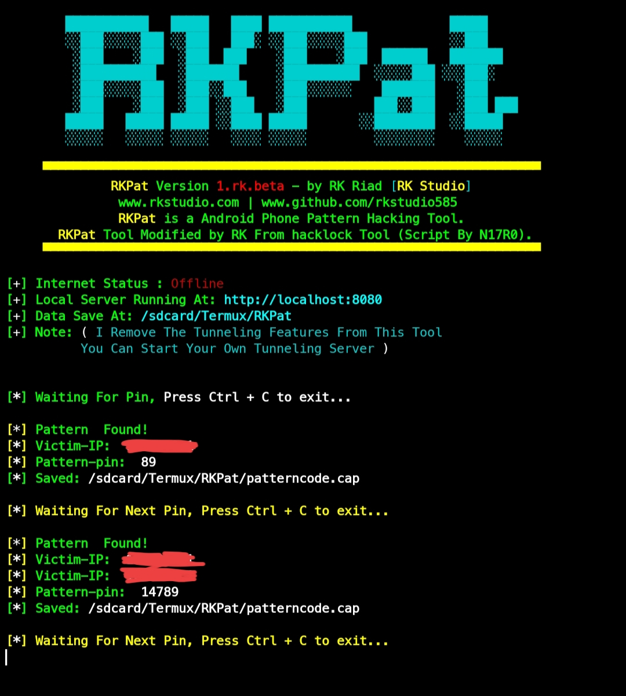

# RKPat 🔒🔐

RKPat is a bash based script which is officially termux from this tool in just one click you can generate pattern phishing tool which can hack victim pattern and. This tool works on both rooted Android device and Non-rooted Android device.


---
## What is RKPat:
 - You can create phishing pattern link which get keys of victim pattern after he used this link.

---
## Features:
  - The tool offers a wide range of features and functionality, including:
    - Real Pattern Hacking.
    - Automated Data Collection.
    - Easy To Use.
    - User-friendly Interface.

---
## Note:
  - I Remove The Tunneling Features From This Tool You Can Start Your Own Tunneling Server.
  - This Tool Only Supposed On Termux So Enjoy.
  - Don't delete any of the scripts included in `core` files
  - You Can Delete `raw` Folder And `README.md LICENSE` File If You Need.
    - Command:
      ```bash
      rm -rf raw .git README.md LICENSE
      ```
---
## This Tool Tested On:
  - Termux 

---
## Installing and requirements.
This tool require PHP for webserver.
- If You Not Instead To Install Requirements Package 📦 Like That This Tool Auto Download The All Requirements Package 📦.
  - Command:
    ```bash
    apt install php git -y
    ```

---
## Installing (Termux):
Download This Tool On Your Termux App And Run.
- Command:
  ```bash
  git clone https://github.com/rkstudio585/RKPat.git
  cd RKPat
  bash rkpat.sh
  ```

---
## Tool Special Note:
  - RKPat is created to help in penetration testing and it's not responsible for any misuse or illegal purposes.
  - Hacklock Tool Modified by RK And Create A new Tool Called RKPat.
    - Script By N17R0.
    - Tool Create By Noob Hackers.
    - Tool Modified By RK.

## Original Tool Link:
  - Hacklock Tool By Noob Hackers.
    - [Hacklock Tool GitHub](https://github.com/noob-hackers/hacklock)
    - [Noob Hackers GitHub](https://github.com/noob-hackers)

---
## Screenshots:

- Example Number 1:
  - 
---
- Example Number 2:
  - 
---
- Example Number 3:
  - 
---
- Example Number 4:
  - 

---

# ** Enjoy! 😍 **

---
